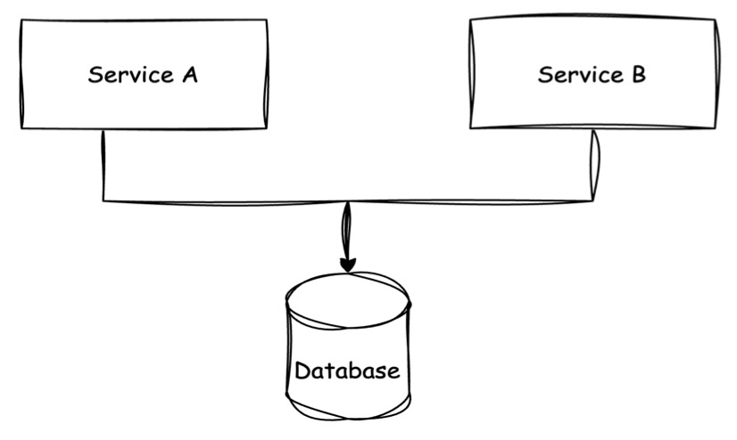
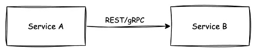
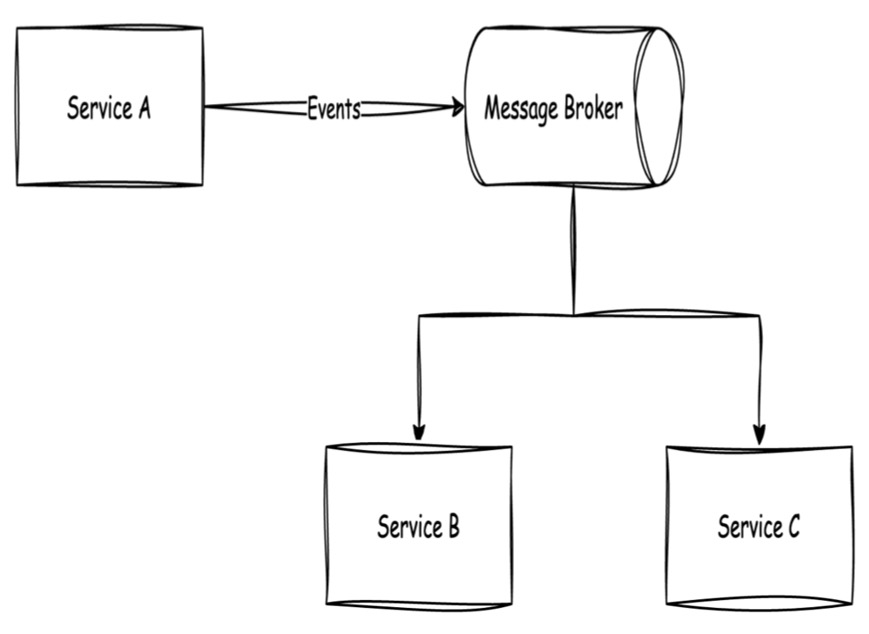
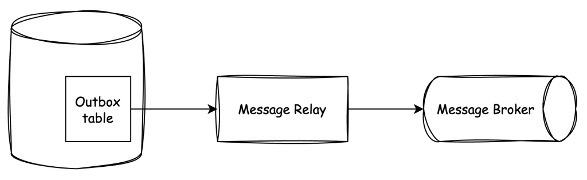
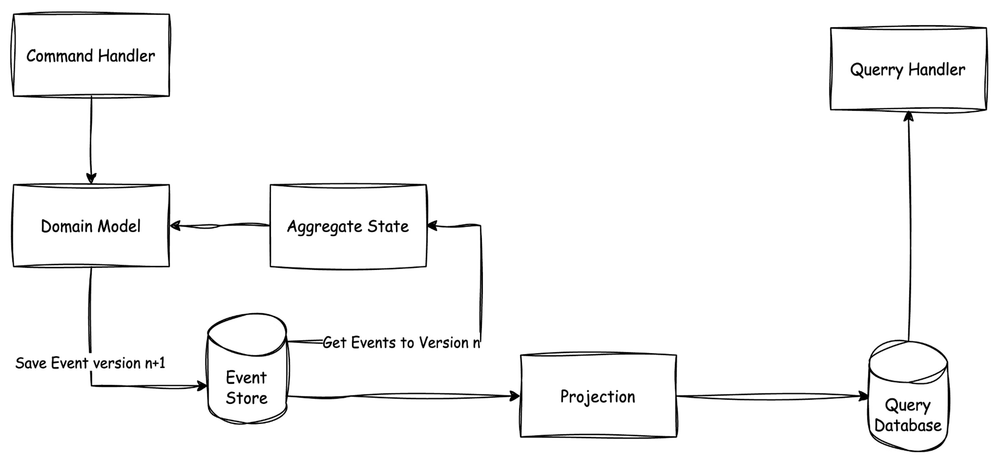
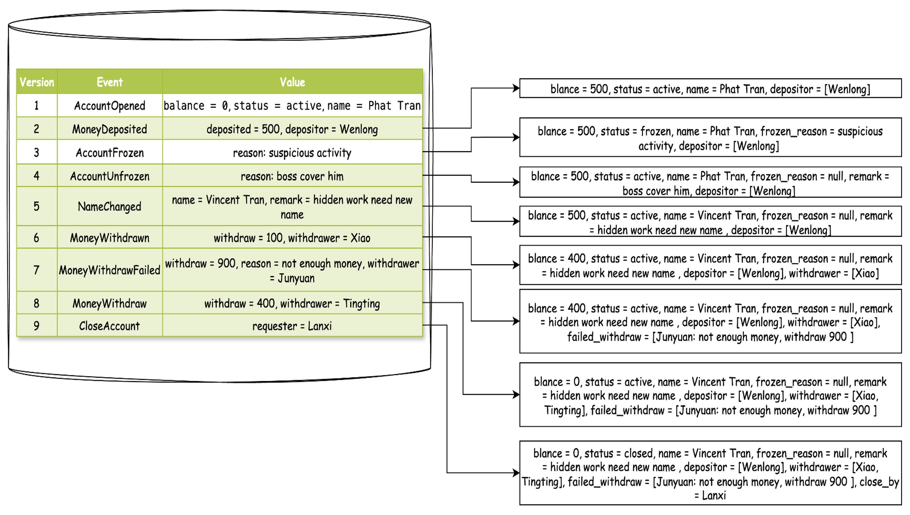

## **1. Where Things Start to Suck**  
### **Why Communication Between Microservices Is Harder Than It Looks**

Building microservices? Migrating from a monolith? Doesn’t matter. The moment you have more than one service owning data, communication becomes the real beast.

Your neat service boundaries don’t mean much if Service A needs data from Service B and the whole thing grinds to a halt because one endpoint is flaky. That local `function()` call you took for granted? It’s now a network call—slow, unreliable, and full of edge cases.

This is where most systems break. Not at “scale.” Not at “machine learning.” At **"how the hell do I get this data over there?"**

This article walks through how data moves between services:
- What people do in the beginning (and regret later)
- How async messaging and event-driven design actually help
- When to use replication and CDC without shooting yourself in the foot
- How not to lose events and keep your sanity

No fluff. Just patterns, trade-offs.

---

## **2. Shared Database: The Classic Trap**

At some point, someone decides:  
> “Why don’t we just let all the services access the same database? It’s faster and we don’t have to deal with APIs.”

Sounds smart. It’s not.

Letting multiple services hit the same physical database looks easy—until it turns your system into a giant, unversioned spaghetti monster. You’ve just killed any hope of proper ownership, encapsulation, or independent deployability.

### Why This Happens
- It’s fast to build.
- No need to design APIs.
- Feels like the “monolith, but modular.”

### Why It Blows Up
- **Tight coupling**: One service changes the schema, another breaks.
- **No autonomy**: Can’t scale or deploy independently.
- **No boundaries**: Everyone’s reading and writing whatever they want.
- **Hidden dependencies**: No one knows who depends on what anymore.
- **Zero traceability**: Good luck debugging which service did what.

> You didn’t build microservices. You built a **distributed monolith**. A shared database is like everyone sharing one toothbrush—cheap, quick, and disgusting in the long run.

### ⚠️ If You Absolutely Have To (But You Shouldn't)

Alright. Let’s say you’re in a fire-fighting phase, a team needs data fast, and you’ve got zero bandwidth to design clean APIs. Fine. Here’s how to keep the damage contained:

- **Internal-only tooling**, low-risk, low-impact.
- **Temporary hacks** — but write it down, flag it, and kill it in a follow-up sprint.
- **Read-only access** for BI/reporting services — isolate it to a read replica if you’re smart.

Even then, you’re skating on thin ice.

### 🚫 What Not to Do (Seriously, Stop It)
- Don’t let services **write** to each other’s tables. You’re just begging for corruption.
- Don’t skip APIs because “it’s faster.” That’s not speed—it’s debt.
- Don’t pretend this is okay “for now” and forget about it. That’s how systems rot.

Got it—no more bullet-to-bullet slide copying. Let’s rewrite the **Direct Service Calls** section as a proper article section—narrative, sharp, and in your style.

---

## **3. Direct Service Calls (Point-to-Point)**  
### *Real-Time, Real Fast, Real Fragile*

Once your services have their own data, they need to talk. The instinctive move?  
**“Just call the other service.”**

It’s simple. Service A hits Service B over HTTP or gRPC. You get a response, update your flow, done. This feels just like calling a local function—only it’s going over the network now.

And that’s where it starts to hurt.

Direct calls introduce **runtime coupling**. If Service B is slow, A is slow. If B is down, A is probably broken too. Chain a few of these together, and one bad apple can take out the whole orchard.

This pattern is natural. But if you don’t design for failure, you’re setting yourself up for pain.

---

### What You’re Getting Into

The good:
- You get results **right now**. No need to wait for events or build extra read models.
- Debugging is straightforward. You know who made the call and what it got back.
- Teams don’t have to learn new mental models—just build and call APIs.

The bad:
- **Every service is now part of your availability story.**
- Latency adds up fast. A → B → C → D → timeout.
- One slow call and suddenly users are blaming your UI.
- It pushes you toward a distributed monolith if left unchecked.

### Use It Like a Grown-Up

> One direct call? Fine. Five chained calls? You’ve built a Rube Goldberg machine with a timeout problem.

Direct calls **aren’t wrong**. They’re essential in places where consistency and timing matter—like confirming a payment or validating an action before it moves forward.

But you need to **wrap them in protection**:
- Use **service discovery** so you’re not hardcoding IPs like it’s 2000s.
- Implement **timeouts** and **circuit breakers**—don’t rely on hope.
- Consider a **service mesh** (like Istio, Linkerd, or Consul) to offload retries, mTLS, and observability.
- And for the love of uptime, don’t chain too many sync calls together.

Use this pattern when the trade-off is worth it. But design like **the other service will go down at the worst time**—because it will.

---

## **4. Asynchronous Messaging**  
### *Loose Coupling, Eventual Thinking*

Sometimes a service doesn’t need an answer—it just needs to tell the world something happened. That’s where **asynchronous messaging** fits in.

Instead of making a synchronous call and waiting for a response, a service emits an event—like `OrderCreated` or `InvoicePaid`. It pushes that to a message broker (Kafka, RabbitMQ, NATS, etc.), and other services subscribe to those events and react in their own time.

It’s not better or worse than a direct call—it’s a **different shape of communication**. Use it when the need fits.

---

### What It Enables

Asynchronous messaging allows services to communicate without depending on each other's uptime or immediate availability. It removes the tight runtime coupling that comes with direct calls. You can have multiple consumers listening to the same event, reacting differently, scaling separately, and even being deployed independently. One event can drive fan-out workflows like notifications, fulfillment, or analytics—all without the sender knowing or caring who’s listening.

It also improves system resilience. If a subscriber is down, it can catch up later. If you need to onboard a new consumer, you don’t need to touch the publisher. And most importantly: the publisher doesn’t break just because someone downstream had a bad day.

---

### What It Demands

With that freedom comes responsibility. You lose immediate feedback—there’s no response, no confirmation, no “success.” That means you have to build for eventual consistency, and that’s not always easy to reason about.

Observability becomes trickier. If something silently fails or lags behind, it may take a while to notice. You’ll need structured logging, traceability, and solid metrics to debug async flows. Message delivery also becomes your problem: will it be at-most-once, at-least-once, or exactly-once (spoiler: the last one is a lie without a lot of pain)?

And even though services are decoupled at runtime, they still depend on the shape of the events. Schema evolution, contract testing, and clear ownership of events are just as critical here as in API-driven systems.

---

### When It Fits

Asynchronous messaging is a strong fit when you’re designing for workflow orchestration, domain integrations, or decoupling. If a service can say “this happened” and doesn’t care who reacts, this pattern gives you breathing room and extensibility.

It’s also the go-to model for cross-cutting concerns like logging, audit trails, background processing, or reacting to state changes in systems that aren’t owned by your service.

It’s not about replacing direct calls—it’s about using async where immediate feedback isn’t needed, and flexibility is worth more than instant answers.

You reach for async messaging when the system needs to **react**, not wait. It’s not about “better” or “faster”—it’s about the shape of the problem.

**Use it when:**

- 🔁 **You’re building asynchronous workflows**  
  A process involves multiple steps across services—user signs up, then gets an email, then gets their onboarding flow initialized. Each step can run independently and doesn’t need a real-time guarantee.

- 🔄 **You’re integrating across domain boundaries**  
  Service A doesn’t own the logic of Service B. Instead of calling and coupling tightly, it emits events that B can respond to on its own terms. It’s a clean contract without tight binding.

- 🔓 **You want decoupling without losing visibility**  
  Multiple services might care about the same event—like `InvoicePaid`. Instead of A knowing everyone to notify, it just emits the fact, and subscribers take care of their part. This gives you extensibility without rewriting the origin.

Perfect—let’s frame the **Outbox Pattern** as a **subsection** under **Asynchronous Messaging / Event-Driven Architecture**, since that’s where it lives conceptually. Here’s how to adjust the flow:

---

### Reliability in Event-Driven Systems  
#### *The Outbox Pattern: Send Events Without Screwing Up Your Data*

Once you start emitting events, the question becomes: **how do you make sure they actually get delivered?**  
You can’t just `db.save()` and then `.publish()` and call it a day—because if publishing fails, your system ends up in an inconsistent state.

This is where the **Outbox Pattern** comes in.

Instead of sending events directly after a write, you write the event to an **outbox table** inside the same database transaction as your domain change. A background process (or CDC tool) later picks it up and publishes it.

This pattern guarantees that either:
- Both the data and the event get persisted, or
- Neither of them does.

It’s simple, boring, and it works.

- Service updates its own database (e.g., changes order status).
- It also inserts an event (e.g., `OrderPlaced`) into a dedicated `outbox_events` table in the same transaction.
- A separate publisher reads from this table and sends the events to a broker.

No risk of partial updates. No lost events. Just clean handoff.

---

#### When It’s Worth Using

- You want **reliable, consistent event delivery** without going full event sourcing.
- Your service needs to emit events as part of its core logic, not as an afterthought.
- You can’t afford dropped messages—but don’t need two-phase commits either.

Especially useful in **transactional business domains** where correctness matters more than speed.

> Event-driven doesn’t mean “fire and forget and hope.”  
> You need patterns like this to make sure the system holds together under pressure.

Outbox isn’t optional—it’s essential when messaging matters.

---
## 5. Event Sourcing & Event Store  
### *Don't Just Store the State — Store the Story*

Most systems store the final result: “Account balance is $0.” But what they don’t store is how it got there.

Event Sourcing flips that mindset. Instead of saving the latest state, you save **each business decision** that *led* to that state. You store facts: `AccountOpened`, `MoneyDeposited`, `MoneyWithdrawn`. Those events become your source of truth — not just metadata. The final state is a consequence of applying these events in order.

You're not capturing state—you’re capturing **intent, history, and meaning**.

---

### Modeling Business as It Actually Happens

When you model with events, you're not just building software — you're representing **how the business actually operates**. A change in balance isn’t just a new number; it's a result of a decision. These aren't CRUD operations. They're **business moments**.

Every change is an event. Every event is immutable. Every event is meaningful. That sequence of decisions becomes your system's memory — a reliable, replayable timeline.

This unlocks real-world clarity:
- Why is this account frozen?
- What name was on the account during the last withdrawal?
- When was the transition from pending to closed?

You don't query five tables. You read the timeline.

---

### How the System Works Internally

When a command like `CloseAccount` is issued, the system applies domain logic and emits a new event: `AccountClosed`. That event is persisted to an **append-only event store**, applied to the aggregate to evolve its state, and optionally broadcasted to other services.

The aggregate never stores the final state directly. It’s rebuilt by replaying its event history. This guarantees consistency, traceability, and recovery. The behavior is deterministic.

---

### Read Models and Projections

You don’t query the event log directly for reads. Instead, **projections** build dedicated, query-optimized views of the event stream. These projections are typically stored in their own databases or indexes (e.g., Postgres, MongoDB, Elasticsearch).

Projections decouple the read model from the domain model, enabling:
- Custom read views per use case
- Fast query performance
- Safe rebuilds via event replay

They also enable system resilience: if a read model is corrupted, replay the stream and rebuild.

---

### When to Use Event Sourcing (And When Not To)

Event Sourcing isn't for everything. It’s **not** a default choice. It's a strategic one.

It fits well when:
- The domain has **complex workflows** or lifecycles
- You need **auditability**, **traceability**, or **replayability**
- You require **time-travel debugging** or rollback
- Events represent **real-world business facts**

It’s overengineering when:
- The domain is CRUD-heavy and flat
- Events are synthetic and meaningless
- The cost of projections outweighs the benefits
- You're doing it "because it looks cool"

Use Event Sourcing when behavior matters more than structure. Skip it when you just need data.

---

### Event Sourcing vs. Event-Driven Architecture

These two often get mixed up. They’re related, but serve different purposes:

- **Event Sourcing** is a *persistence and modeling* strategy. It lives **inside** a service. You store events as the canonical source of truth.
- **Event-Driven Architecture** is a *communication* strategy. It connects services using published/subscribed events.

You can do EDA without sourcing. You can source without broadcasting. Many systems use both together.

---

### Event Store: The Source of Truth

The **Event Store** is not just a place to keep logs. It's your primary database. It's append-only, immutable, and designed for **replayable truth**.

Key properties of an event store:
- Ordered, immutable streams per aggregate
- Idempotent event appends
- Support for snapshots and schema evolution
- Replayability for projections and aggregate rebuilding

This is not Kafka. This is not a side table. This is your **system of record**.

The event store enables:
- State reconstruction from first principles
- Infinite audit history
- Safe recovery from corruption or bugs
- Projections and derived data that are always replaceable

But it comes with real trade-offs.

---

### Trade-Offs and Costs

Adopting Event Sourcing and an Event Store means taking on:
- Higher complexity in modeling and infrastructure
- Managing event schema evolution
- Maintaining projections and replay pipelines
- Snapshot strategies for performance
- More work upfront in understanding domain logic

You also write your domain logic twice:
- **Aggregates** focus on consistency, enforcing business rules during commands
- **Projections** focus on efficient querying, tailored for read models

This duplication is intentional. It reflects **CQRS**: the separation between commands (writes) and queries (reads).

It's not DRY. It's **explicit responsibility separation**.

---

