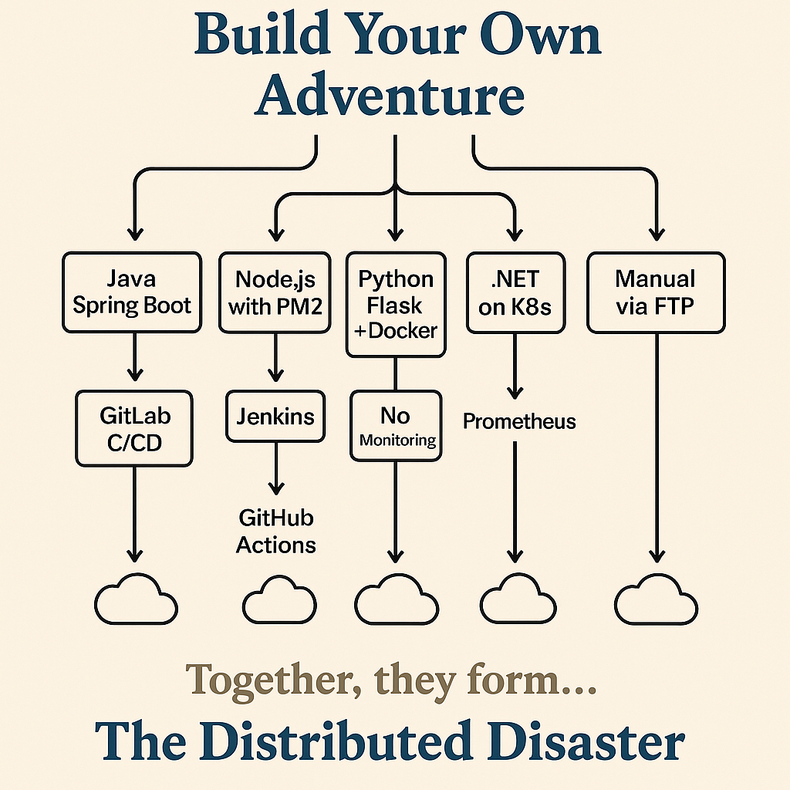
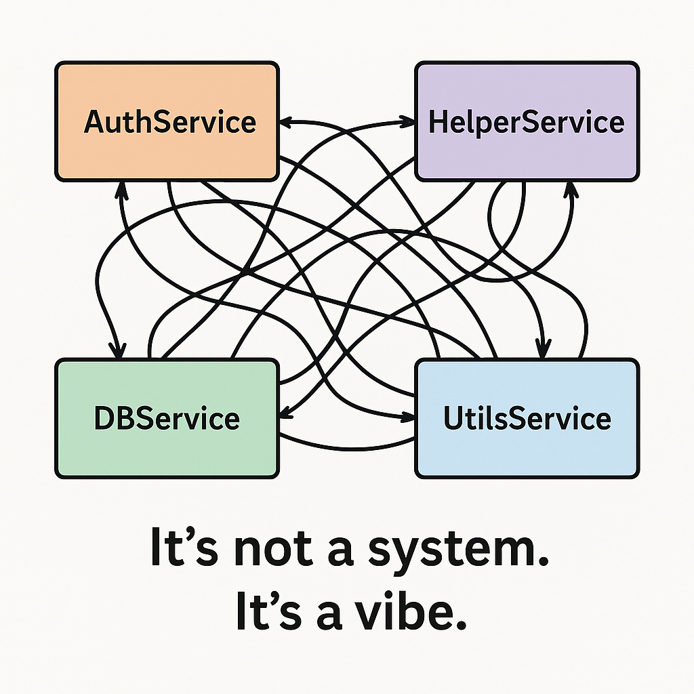
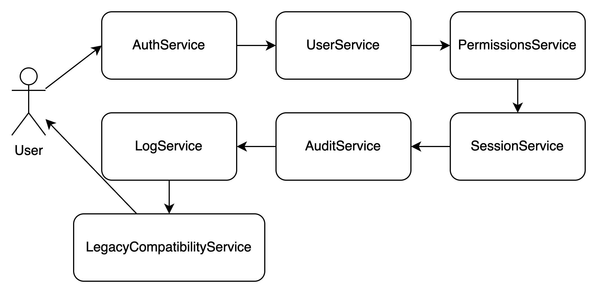
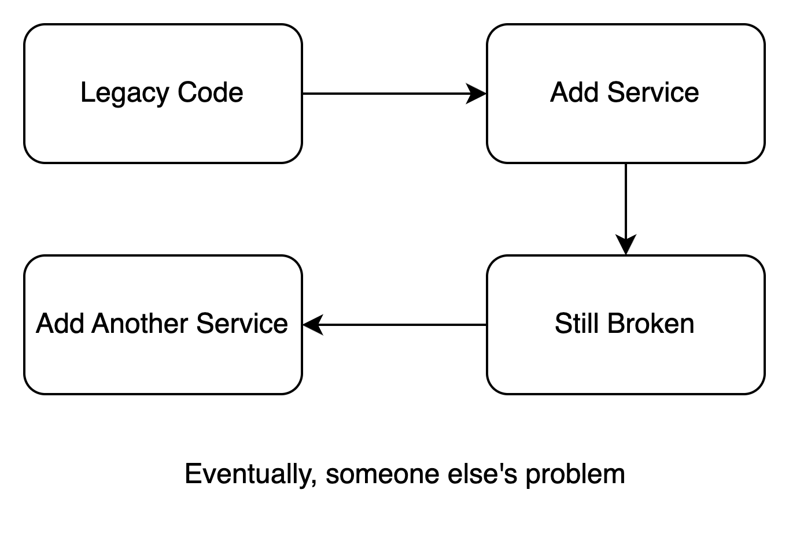
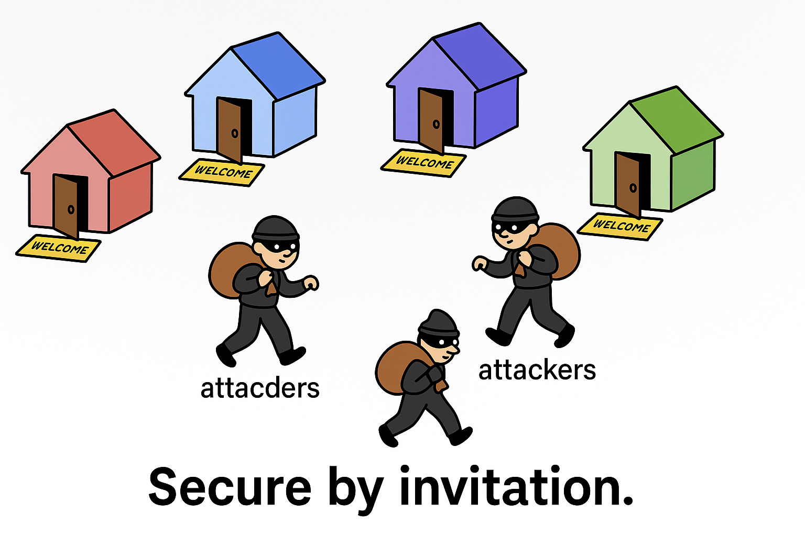

# **How to Let Microservices... Fail Successfully!**
### *A Field Guide to Failing with Microservices (and Blaming Everyone Else)*

---

## Introduction: The Path to Glorious Failure

So, you've been told microservices are the future.  
They're scalable! They're flexible! Everyone from your CEO to your cousin’s two-person startup is talking about them.

But deep down, you're skeptical... or maybe just lazy. You don’t want to lose your job. You want an exciting daily task—one that always keeps you busy, but never involves fixing bugs, tracking issues, or writing logs. That way, the boss can’t fire you because, hey, you're *always working*.

So instead of succeeding, you’ve decided to create a beautifully broken microservices system.  
And we love that for you.

Welcome to the field guide for failing with microservices—**intentionally and thoroughly**.  
Whether you're a Product Manager, Developer, Architect, DevOps, or BA, we've got failure strategies just for you.

> *A handbook of horror. A celebration of failure.*

---

## 1. Start with No Strategy

### Ignore Business Goals Entirely

Who cares *why* we're building this thing?  
Microservices are trendy! Let's break everything into tiny chunks without understanding what the business wants.

Microservices are **not** a strategy in themselves. Yet, many teams rush into them just because it's the "modern" way.  
The result? A system full of technical abstraction with no real alignment to business needs.

**This is your checklist:**
- Focus on tech trends rather than solving business problems.
- Treat microservices as the end goal, instead of a means to an end.
- Let developers design services without understanding business processes.
- Never map services to actual business capabilities or domains.
- Use vague goals like "agility" without defining what it means or how to measure it.

> **Reminder:** Never talk to a BA. They might inject logic. If they start explaining the domain, you might accidentally do it right.

---

### Overpromise & Underdeliver

Sell microservices as a silver bullet that will solve *all* performance, scalability, and deployment issues—**overnight**.

Make microservices sound like magic.  
Management will believe you. Stakeholders will be excited.  
And then, reality hits.

Don't bother tying microservices to any larger business objectives.  
If you can't explain why you're doing microservices beyond "they're modern," you're off to a perfect failing start!

**Propose:**
- Plan 100 microservices in 2 months, with no added team or budget.
- Tell the C-levels microservices will triple your velocity, cut costs in half, and maybe even save the world.
- Miss every deadline. Then say:  
    > "The complexity of distributed systems is to blame. Not me."

"Faster time to market" with no measurable definition. Stay vague. Stay safe.

> **Bonus:** Promise it'll all be done in 3 months. That's 12 weeks. 100 services. Easy.

---

### Let Every Team Do Their Own Thing (Just YOLO It)

Without alignment, autonomy becomes anarchy.

Microservices *thrive* on consistency in tooling and approach. Without it?  
You're just building chaos, team by team.

**Codex:**
- Allow each team to choose their own tech stack, deployment strategy, and own CI/CD.
- Avoid shared documentation or coding standards.
- Ensure dev, staging, and production environments are wildly inconsistent.

> "Don't tell DevOps—they'll try to standardize things and ruin your creative chaos."

---
### “We’ll Fix It Later” as a Way of Life
- Planning? That’s for people with time. We ship features, not diagrams.
- Engineering best practices?  CI/CD, linting, tests, observability skip it. If the app runs on one laptop, it’s ready for prod.
- No need to tests. No logging. No monitoring. Just push it to production and hope. After all… our users are the best testers, right?

And when something breaks? Say the sacred phrase:
> “We’ll fix it later.”

**Note**: Later never comes. But the outages will.

## 2. Design & Architecture: Build the Perfect Mess

### DDD = Don’t Do Design
> Boundaries are for people who read books.

DDD helps align software with business logic.  
But who has time for that?

Bounded contexts? Strategic design? Pfft.  
Just guess the microservice boundaries and figure it out later (or never).

**Follow this:**
- Break services by technical layer (`AuthService`, `DBService`, `UtilityService`) instead of business capability.
- Allow overlapping responsibilities across services.
- Duplicate business logic everywhere to “stay agile.”
- Skip modeling domains with BAs. Guessing is faster (and more fun) 

> Don’t talk to BAs: they’ll just slow you down with “understanding the domain.”

---

### Create the Distributed Monolith
> Now with more latency and more regret!

Keep all the problems of a monolith—but now with added latency!

Looks like microservices, behaves like a monolith.  
Everything’s tightly coupled, deployed together, and fails as a unit.

**Checklist:**
- Use a shared database accessed by many services.
- Require coordinated deployments across multiple services.
- Share internal models and logic across boundaries.

*You've successfully achieved the worst of both worlds: the rigidity of a monolith, with the fragility of a distributed system.*

---
### Design for Maximum Chattiness

More service calls = more fun!

Excessive inter-service communication leads to latency, complexity, and instability.  
The more they talk, the more they break.

**Design tips:**
- Use synchronous calls for everything.
- Nest service calls like Russian dolls.
- Never use retries or circuit breakers.  
  > “We trust our services. Always.”

> Don’t involve architects. They might suggest “patterns.” Gross.

---

### Break Everything Into Nano-Services

Take "micro" **literally**.  
Split services so fine-grained that no single one does anything meaningful.

A login request? Easy. Just call:
- `AuthService`
- `UserService`
- `PermissionsService`
- `SessionService`
- `AuditService`
- `LogService`
- `LegacyCompatibilityService`

> “Don’t involve the architect—they’ll ask for boundaries and cohesion.”

Bonus: The more lines on the architecture diagram, the more success it looks like.

---

### Pile Up Microservices to Hide the Rot

Got technical debt? Just **wrap it in another microservice**.

**Solutions:**
- Create `LegacyWrapperAdapterProxyService` so no one has to look too closely.
- Every time something feels wrong, solve it with another service layer.

---

## 3. Infrastructure & Operations: Build It, Never Watch It

> If architecture doesn’t kill the system, the ops will.

### No Monitoring, No Logs, No Problem

If no one can see it fail, it didn’t fail, right?

**Best Practice:**
- Don’t collect metrics, logs, or traces.
- Scatter logs across nodes. No correlation IDs.
- Never test failure scenarios in staging.

> Keep DevOps guessing. It builds character.

**Bonus tip:** Only log successful requests. Errors are for pessimists.

> This... is the Schrödinger’s Service Box.
Until someone checks, your service is in a quantum state: it's both failing and totally fine at the same time.
Because without logs, metrics, or monitoring… reality is just a guess.

---

### Expose Everything to the Internet

Your services are open—like your heart.  
Except attackers love open hearts.

**Tips:**
- No API gateway or network boundaries.
- Hardcode credentials and commit them to source control.
- Let each service handle authentication “creatively.”

> “Security team? Never heard of them. They always ask dumb things like:  
> *‘Why is your auth token `admin123` publicly cached?’*”

Real tip: Put credentials in Git. Blame the `intern`.

---

## 4. Development Practices: Make Devs Cry

Automation is for the weak.  
The less automation, the more chaos. Manual steps are the gift that keeps giving—mostly headaches.

---

### Manual Everything

**How to do that ?**
- No CI/CD pipelines. Deploy manually. Preferably via SSH. 

> CI = Ctrl + “I push to prod"

- Run builds on local machines and push straight to prod.
- Forget automated tests. Just "click around" to check.

> Keep DevOps in the dark. If they see you SSH into prod, they’ll revoke your VPN.

---

### Copy-Paste All the Code

Why reuse a shared library when Ctrl+C and Ctrl+V exist?

**How ?**
- Ctrl+C => Ctrl+V and forget. Once copied, never synced.
- Fix bugs in one place, let others rot.
- Reinvent auth, validation, and logging in every service.

The perfect recipe for conflicting bug fixes and inconsistent logic.

---

### Break APIs Often and Without Warning

APIs are your contract. Breaking them is betrayal—unless you **enjoy** pain.

**What you need to do:**
- Change request/response structures at will.
- Delete endpoints and see who notices.
- Skip versioning. Versioning is for cowards.

> Keep frontend teams in suspense. Will the API work today? Tune in to find out!

Bonus points if older versions have **zero** backward compatibility.

---

## Bonus Round: Team-Level Sabotage

- **BA**: Ignore them when modeling services. Let devs reconstruct business logic from Slack messages.
- **Developer**: Don’t write tests. Let production validate your code.
- **QA**: Accept bugs as “features in disguise.”
- **DevOps**: Push infrastructure changes directly to production. No warning.
- **PM**: Change priorities mid-sprint. Agile = chaos, right?

---

## Final Words: How to Fail... Successfully!

By following this guide, you'll:
- Burn time and budget
- Build a glorious spaghetti mess of distributed services
- Blame everyone else when it explodes
- Become irreplaceable—because you're the only one who knows where all the bodies are buried

Whether you're in business, architecture, ops, or dev, there's a role for **everyone** in this glorious disaster.

---

## Secret Ending: What You'd Do If You Wanted to Succeed  
*(Here's some of the chew on. You can think about your own experiences)*

Have you seen any of these failure strategies creeping into projects you've been on?

Maybe even by chance used when yourself. We've all been there probably. And what happened, what were the results? 

Maybe also consider that secret ending. 

> Actually aligning with business domains, having standards, designing for resilience and decoupling, focusing on security, traceability, and team collaboration.

Imagine actively avoiding all these failure modes.

It might lead to surprisingly stable, functional, maybe even slightly less dramatic outcome.
